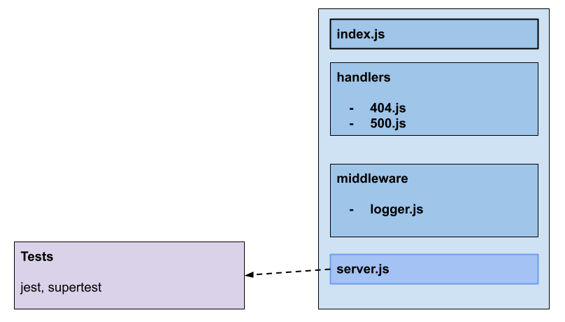

# LAB - Class 01

## Project: Server Development Practice

### Author: Kenny W. Lino

### Problem Domain  

This application servers as an example for how to create and deploy a server with our own custom middleware and handlers.

### Links and Resources

- [ci/cd](https://github.com/kennywlino/server-deployment-practice/actions)
- [back-end server (production)](https://dashboard.render.com/web/srv-ce2l93da49927285l90g/deploys/dep-ce2lcgsgqg4a25bjkd20)
- [PR from dev](https://github.com/kennywlino/server-deployment-practice/pull/1)

### Setup

#### `.env` requirements (where applicable)

i.e.

- `PORT` - Port Number

#### How to initialize/run your application

- nodemon

#### How to use your library (where applicable)

#### Features / Routes

- GET : `/` - default route to hit
- GET: `/bad` - route for testing errors

**Middleware**

- logger.js - a basic, custom middleware that logs the date

**Handlers**

- 404.js -- handles 404 errors
- 500.js -- handles 500 errors

#### Tests

- How do you run tests?
  - npm test

- Any tests of note?
  - handles root path
  - handles invalid requests
  - handles errors

#### UML

